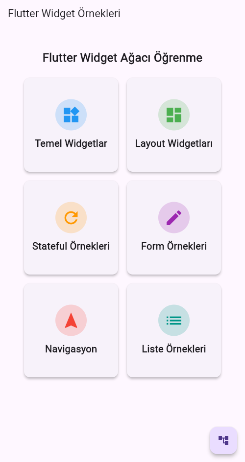
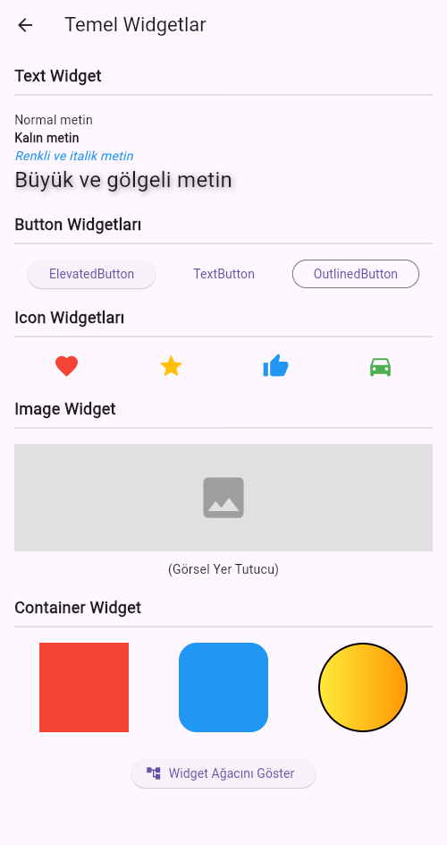
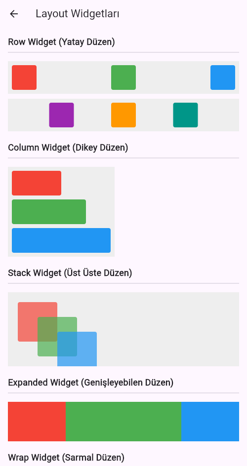
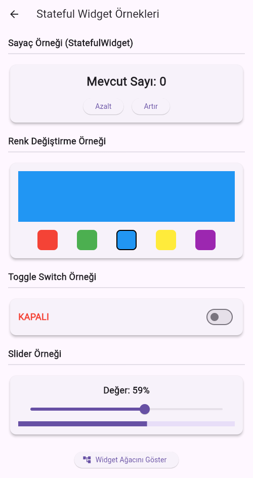
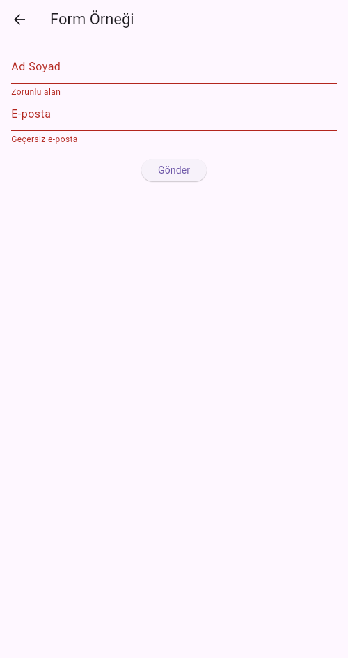
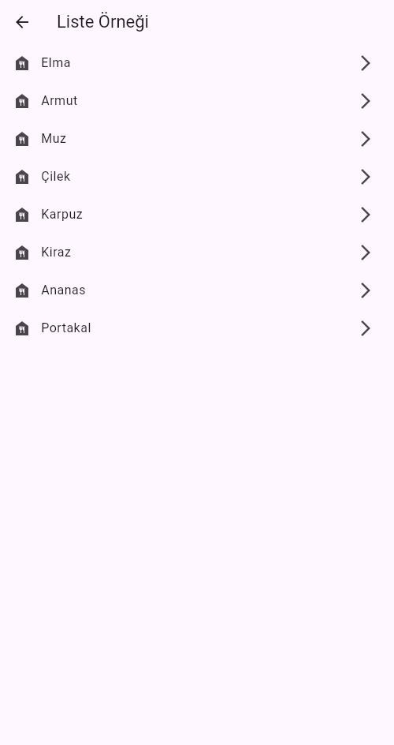

# Flutter Widget Öğrenme Projesi

Bu proje, Flutter widget'larının kullanımı ile ilgili örnekler içerir. Farklı widget türlerini öğrenmek isteyenler için interaktif bir uygulama sunmaktadır.

## 📱 Ekran Görüntüleri

### 1. Ana Ekran
Ana ekran, uygulama içerisindeki widget kategorilerini gösterir.



### 2. Temel Widgetlar
Bu sayfa, temel Flutter widget'larını içeren örnekleri gösterir.



### 3. Layout Widgetları
Farklı düzen widget'larını kullanarak uygulamanın görünümünü şekillendiriyoruz.



### 4. Stateful Widget Örnekleri
Stateful widget'ların kullanımını göstermek için yapılan örnekler.



### 5. Form Örnekleri
Form widget'ları kullanarak veri girişi işlemleri.



### 6. Navigasyon ve Listeleme
Navigasyon ve listeleme işlemlerini gösteren sayfa.



### 7. Widget Ağacı Gösterimi
Widget ağacını görsel olarak gösteren araç.


## 🎥 Demo Videosu

Projenin nasıl çalıştığını ve widget'ların nasıl kullanıldığını görmek için aşağıdaki demo videosunu izleyebilirsiniz:


Eğer video görüntülenmiyorsa, [buraya tıklayarak indirip izleyebilirsiniz.](demo.mp4)


## 🚀 Kullanım

Proje, Flutter SDK ve gerekli bağımlılıkları kurduktan sonra kolayca çalıştırılabilir.

### Gereksinimler
- Flutter SDK
- Android Studio / Visual Studio Code

### Kurulum

1. Bu projeyi bilgisayarınıza klonlayın:
    ```bash
    git clone https://github.com/abdulkadiryugruk/flutter_learning_widgets.git
    ```

2. Gerekli paketleri yükleyin:
    ```bash
    flutter pub get
    ```

3. Uygulamayı çalıştırın:
    ```bash
    flutter run
    ```

## 📄 Lisans

Bu proje MIT lisansı ile lisanslanmıştır. [MIT Lisansı](https://opensource.org/licenses/MIT).
